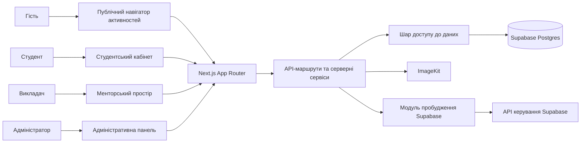
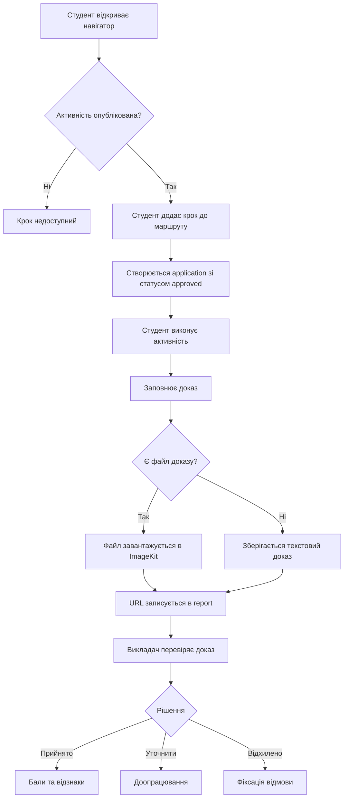
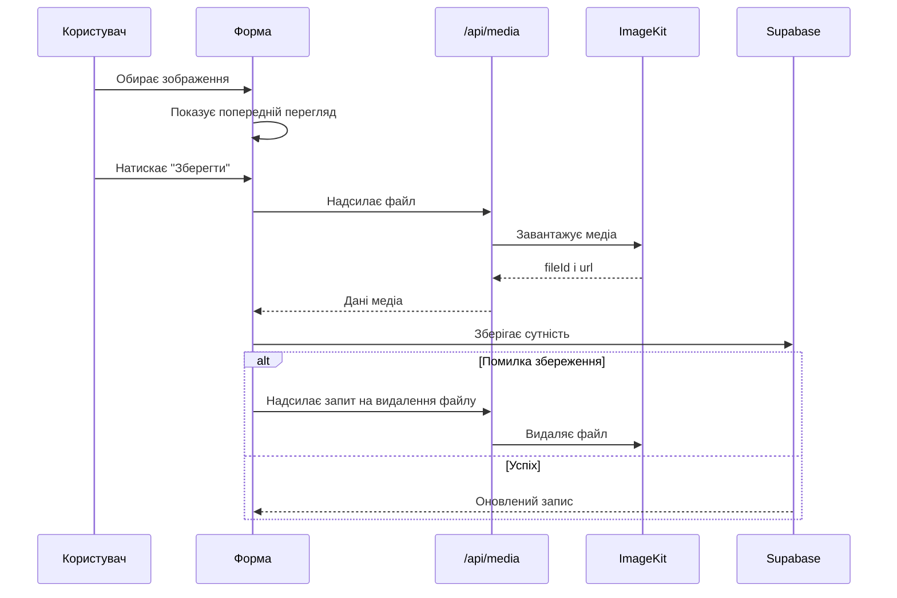
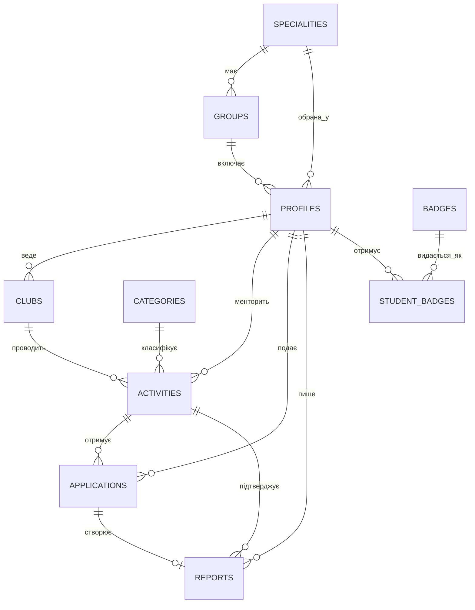
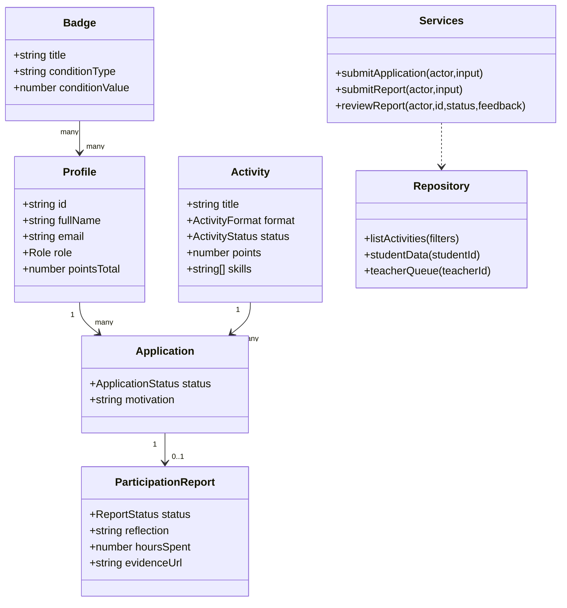

# ПОЯСНЮВАЛЬНА ЗАПИСКА ДО ДИПЛОМНОЇ РОБОТИ

Тема: **Розробка вебзастосунку “StudentFlow” для управління позааудиторною активністю студентів**
---
# РЕФЕРАТ

Пояснювальна записка присвячена розробці вебзастосунку **StudentFlow**, який забезпечує керування позааудиторною активністю студентів, формування індивідуального маршруту розвитку, подання доказів участі, перевірку результатів викладачем та адміністрування довідників, груп, спеціальностей, активностей і відзнак.

У роботі проаналізовано предметну область позааудиторної діяльності, розглянуто аналоги платформ студентського залучення, обґрунтовано вибір архітектури на основі Next.js App Router, серверного шару з Supabase Postgres, ImageKit для медіафайлів та Render для розгортання робочої версії. Окрему увагу приділено ролям користувачів, життєвому циклу активності, доказам результатів, автоматичному нарахуванню балів і відзнак.

Результатом роботи є адаптивний вебзастосунок із публічним навігатором активностей, студентським кабінетом, менторським простором викладача та адміністративною панеллю. Система підтримує початкове наповнення Supabase, синхронізацію медіа з ImageKit, роботу у робочому режимі та механізм очікування доступності бази даних у разі призупинення Supabase.

Ключові слова: **StudentFlow, позааудиторна активність, студентський маршрут, портфоліо, докази, відзнаки, Supabase, ImageKit, Next.js, Render**.
# ABSTRACT

This explanatory note describes the development of **StudentFlow**, a web application for managing students’ co-curricular activities. The system supports activity navigation, personal development routes, evidence submission, teacher feedback, badge assignment, group and speciality management, and administrative CRUD operations.

The thesis analyzes the subject area, compares relevant student engagement platforms, and justifies the selected architecture based on Next.js App Router, Supabase Postgres, ImageKit media storage, and Render deployment. The implementation focuses on role-based workflows for students, teachers, and administrators, as well as on evidence-based participation tracking.

The result is a responsive production-ready web application with a public activity navigator, student workspace, teacher review workspace, and administrative dashboard.
# ЗМІСТ

1. Характеристика об’єкту розроблення, постановка задачі, аналіз літературних джерел та системний аналіз  
1.1. Характеристика об’єкту розроблення та постановка задачі  
1.2. Огляд літератури та аналогічних систем  
1.3. Аналіз і вибір методів, алгоритмів та засобів розв’язання задачі  

2. Розроблення структури, алгоритмів та інформаційного забезпечення  
2.1. Структура або архітектура програми  
2.2. Блок-схеми алгоритмів  
2.3. Діаграми, які описують функціонування системи та її окремих блоків  
2.4. Структура даних та схема бази даних  

3. Розроблення програмного рішення  
3.1. Діаграма класів  
3.2. Опис використаних сторонніх бібліотек та модулів  
3.3. Розробка та опис програмних модулів  
3.4. Розробка та опис інтерфейсу користувача  
3.5. Опис альтернативних підходів, які розглядались під час розробки  
3.6. Опис проблем і нестандартних ситуацій, які виникали під час розробки та заходів для їх вирішення  

4. Експериментальна частина  
4.1. Інструкції адміністратору, програмісту та користувачу  
4.2. Вимоги до апаратно-програмного забезпечення  
4.3. Тестування  
4.4. Оцінювання та аналіз результатів  

Висновки  
Перелік використаних джерел  
Додатки  
# ВСТУП

Позааудиторна активність є важливою складовою розвитку студента, оскільки саме за межами обов’язкових занять часто формуються практичні навички комунікації, командної роботи, самопрезентації, дослідницької культури, лідерства та професійної орієнтації. У коледжі такі активності можуть охоплювати наукові мініпроєкти, дебати, медіамайстерні, кар’єрні зустрічі, спортивні події, студентське самоврядування, волонтерські чи культурні ініціативи. Проблема полягає не лише в організації таких подій, а й у фіксації результатів участі, збереженні доказів і перетворенні розрізнених подій на зрозумілий індивідуальний маршрут розвитку.

Традиційний підхід часто зводиться до оголошень у месенджерах, таблиць учасників, усних домовленостей та окремих файлів зі звітами. У такому форматі студенту складно бачити власний поступ, викладачу — перевіряти докази й давати структурований фідбек, а адміністратору — підтримувати цілісність довідників, груп, спеціальностей та активностей. Тому виникає потреба у вебзастосунку, який поєднує навігатор можливостей, маршрут студента, докази результатів і адміністративний контур.

Метою дипломної роботи є розробка вебзастосунку **StudentFlow** для управління позааудиторною активністю студентів, що забезпечує пошук активностей, формування маршруту участі, подання доказів, менторську перевірку, нарахування балів, видачу відзнак та адміністрування структури даних.

Для досягнення мети потрібно виконати такі завдання:

- проаналізувати предметну область позааудиторної активності студентів;
- розглянути наявні системи для студентського залучення та цифрового обліку позааудиторних досягнень;
- визначити ролі користувачів і ключові сценарії роботи;
- спроєктувати структуру бази даних і зв’язки між сутностями;
- реалізувати публічний навігатор активностей;
- реалізувати студентський кабінет із маршрутами, доказами та відзнаками;
- реалізувати менторський простір викладача для перегляду активностей і перевірки доказів;
- реалізувати адміністративну панель з CRUD-операціями;
- забезпечити роботу з медіафайлами через ImageKit;
- підготувати розгортання робочої версії із Supabase та Render.

Об’єктом розроблення є процес організації та обліку позааудиторної активності студентів.

Предметом розроблення є вебзастосунок StudentFlow, його інформаційна модель, серверна логіка, користувацькі інтерфейси та алгоритми обробки маршрутів, доказів і відзнак.
# 1. ХАРАКТЕРИСТИКА ОБ’ЄКТУ РОЗРОБЛЕННЯ, ПОСТАНОВКА ЗАДАЧІ, АНАЛІЗ ЛІТЕРАТУРНИХ ДЖЕРЕЛ ТА СИСТЕМНИЙ АНАЛІЗ
## 1.1. Характеристика об’єкту розроблення та постановка задачі

У StudentFlow позааудиторна активність розглядається не як окрема подія в календарі, а як контрольований крок особистого студентського маршруту. Кожен такий крок має напрям розвитку, опис очікуваного результату, відповідального викладача, клуб або ініціативну групу, дату, кількість місць, бали, вимоги до участі та набір компетентностей. Через це система працює не тільки з моментом реєстрації, а з повним циклом: вибір можливості, участь, подання доказу, перевірка, фідбек, оновлення портфоліо та відзнаки.

Проблема, яку розв’язує застосунок, виникає у типових для коледжу ситуаціях: інформація про події розміщена у різних каналах, участь студентів фіксується у таблицях, підтвердження надсилаються окремими файлами, а підсумковий досвід не збирається в одному профілі. У результаті студент не бачить власної траєкторії розвитку, викладач витрачає час на ручну перевірку матеріалів, а адміністратор не має єдиного місця для підтримки спеціальностей, груп, категорій, клубів і облікових записів.

Предметна область StudentFlow складається з кількох взаємопов’язаних контурів:

- **навігаційний контур** — публічний каталог активностей із напрямами розвитку, пошуком і фільтрами;
- **маршрутний контур** — заявки студента, статуси проходження, бали й історія участі;
- **доказовий контур** — текстові звіти, файли, зображення, попередній перегляд і перевірка матеріалів;
- **менторський контур** — робота викладача з активностями, заявками, доказами та коментарями;
- **адміністративний контур** — керування користувачами, групами, спеціальностями, довідниками, відзнаками та медіа.

Таке трактування відрізняє StudentFlow від звичайної сторінки з подіями. Центральною сутністю є не оголошення і не волонтерська заявка, а підтверджений запис у студентському маршруті. Саме тому у вимогах важливими є статуси, докази, фідбек, роль викладача, видимість портфоліо та керування відзнаками.

Основні функціональні вимоги сформовано навколо реальних дій користувачів:

- гість відкриває навігатор, переглядає напрями, шукає активність і переходить на її детальну сторінку;
- студент реєструється як студентський профіль, входить у систему, додає активність у маршрут і подає доказ участі;
- викладач бачить пов’язані з ним активності, опрацьовує докази, залишає фідбек і приймає рішення;
- адміністратор створює та редагує структуру системи, включно з групами на кшталт `ПК-31 (2024-2028)`;
- система завантажує медіа в ImageKit тільки після підтвердження форми й не залишає зайві файли без зв’язку з базою;
- початкове наповнення виконується тільки для порожньої бази, щоб робочі дані не перезаписувалися під час ввімкнення системи.

Нефункціональні вимоги стосуються практичної експлуатації. Інтерфейс повинен бути адаптивним, модальні форми мають коректно працювати на малих екранах, пошук і пагінація потрібні у великих списках, збірка для робочого середовища не повинна містити службових індикаторів розробки, а при тимчасово призупиненому Supabase користувач має бачити зрозумілий екран очікування тільки у випадку реальної недоступності бази.
## 1.2. Огляд літератури та аналогічних систем

Для порівняння обрано не загальні системи керування навчанням і не сервіси керування уроками, а рішення з близької сфери: студентське залучення, цифровий запис позааудиторних досягнень, студентське життя закладу, події, організації, облік позааудиторного досвіду та підтвердження участі. Такий підбір аналогів точніше відповідає темі StudentFlow, оскільки система не замінює навчальний курс, а організовує активності поза аудиторією.

**Suitable** є одним із найближчих аналогів за ідеєю цифрового запису позааудиторних досягнень. Йдеться про електронний документ або профіль, у якому збираються активності студента поза навчальними заняттями: участь у подіях, набуті компетентності, досягнення та проміжні результати. Для StudentFlow важливою стала саме ця логіка: студенту потрібен не список відвіданих подій, а зрозумілий маршрут, який можна показати як портфоліо. Відмінність StudentFlow полягає у локальній моделі коледжу: спеціальності, групи, викладачі, категорії та правила відзнак налаштовуються без великої комерційної екосистеми.

**Modern Campus Involve** орієнтований на студентське залучення, організації, події, позааудиторне навчання і відстеження розвитку навичок. Це рішення демонструє, що позааудиторні події мають бути пов’язані не тільки з календарем, а й із утриманням студентів у навчальному середовищі, участю в організаціях та розвитком компетентностей. У StudentFlow цю ідею звужено до дипломного вебзастосунку: замість масштабної платформи для закладу освіти реалізовано компактні ролі студента, викладача й адміністратора, а контроль результату перенесено у доказ і фідбек.

**CampusGroups by Ready Education** поєднує студентське життя закладу, студентські організації, події, комунікацію, керовані маршрути та цифровий запис позааудиторних досягнень. Для StudentFlow цей аналог є важливим через підхід до маршрутів: студент рухається не хаотично, а через набір напрямів, очікувань і зафіксованих результатів. Водночас CampusGroups ширший за StudentFlow: він охоплює мобільний досвід кампусу, комунікації, організації, інтеграції та інституційні процеси. У власній системі залишено ядро, потрібне для коледжу: активність, маршрут, доказ, відзнака, група та адміністративне керування.

**Anthology Engage** зосереджується на студентських організаціях, подіях, даних про участь, програмних інтерфейсах та інтеграціях. Його цінність для аналізу полягає у тому, що позааудиторна активність трактується як джерело даних для підтримки студентського успіху, а не як другорядний журнал подій. StudentFlow не копіює інтеграційну модель Anthology, але використовує схожий принцип: кожна дія студента залишає структурований запис, який може переглянути викладач або адміністратор.

**Pathify Communities** розвиває ідею єдиного цифрового простору закладу: групи, події, чати, облік позааудиторної участі та цифрова спільнота об’єднуються в одному середовищі. Для StudentFlow важливою є не соціальна мережа кампусу, а сам підхід “єдиного входу” до студентського досвіду. Тому в застосунку зроблено окремий навігатор активностей і кабінети ролей, але не реалізовано чат, стрічку повідомлень або повноцінний портал закладу.

**GivePulse** розглянуто як суміжний, але не базовий аналог. Його сильна сторона — навчання через суспільно корисні практики, керування волонтерською діяльністю, відстеження участі, рефлексивні звіти, цифрові відзнаки та записи досягнень. Для StudentFlow корисними є механіки підтвердження результату та рефлексії, однак предметна область ширша за волонтерство: активності охоплюють дослідження, прототипування, медіа, баланс, лідерство, кар’єру та комунікацію.

Порівняння аналогів за ознаками, важливими саме для StudentFlow:

| Аналог | Близькість до теми StudentFlow | Що враховано у власній системі | Чому потрібне окреме рішення |
| --- | --- | --- | --- |
| Suitable | Цифровий запис позааудиторних досягнень, компетентності, портфоліо | Маршрут, бали, відзнаки, підсумковий профіль | Потрібна локальна структура груп, спеціальностей і викладачів |
| Modern Campus Involve | Події, організації, позааудиторне навчання | Категорії активностей, зв’язок із навичками, роль ментора | Готова платформа надлишкова для коледжного дипломного проєкту |
| CampusGroups | Керовані маршрути, студентське життя, цифровий запис досягнень | Напрями розвитку, кроки маршруту, портфоліо | Не потрібні широкі комунікації кампусу та платіжні/організаційні модулі |
| Anthology Engage | Дані про участь, організації, програмні інтерфейси | Структурований запис участі й адміністративний огляд | Орієнтація на інституційні інтеграції, яких немає в локальному сценарії |
| Pathify Communities | Єдиний цифровий простір студентського життя | Навігатор і рольові кабінети як єдиний вхід | Соціальні функції й чат не входять у мету StudentFlow |
| GivePulse | Суспільно корисні практики, рефлексії, відзнаки | Докази участі, фідбек, значення рефлексії | Фокус сервісу — громадська й волонтерська активність, а не весь позааудиторний маршрут |

Після аналізу аналогів вимоги до StudentFlow сформульовано у більш вузькому й практичному вигляді. Система повинна показувати активності як можливості розвитку, зберігати доказ результату, давати викладачу інструмент перевірки, підтримувати відзнаки, дозволяти адміністратору змінювати довідники без правки коду та залишатися достатньо простою для розгортання на Render із Supabase та ImageKit.
## 1.3. Аналіз і вибір методів, алгоритмів та засобів розв’язання задачі

StudentFlow реалізовано як вебзастосунок, у якому клієнтська і серверна частини поєднані в одному Next.js-проєкті. Такий підхід обрано через потребу тримати поруч публічні сторінки, рольові кабінети, серверні дії, API-маршрути, доступ до Supabase, дані сеансу в cookie та клієнтські інтерактивні форми. Для дипломного проєкту це практичніше, ніж розділяти систему на окрему серверну й клієнтську частину, оскільки вся логіка маршруту студента зберігається поруч із відповідними сторінками.

Технологічний набір підібрано не за принципом демонстрації популярних бібліотек, а за задачами системи:

- **Next.js 15** використано для маршрутизації, сторінок, що формуються на сервері, API-маршрутів і збірки для робочого середовища;
- **React 19** забезпечує інтерактивні форми, модальні вікна, попередній перегляд медіа та локальні стани інтерфейсу;
- **TypeScript** описує сутності `Profile`, `Activity`, `Application`, `Report`, `Badge`, `Group` і зменшує ризик помилок у доменній логіці;
- **Supabase Postgres** зберігає користувачів, групи, активності, заявки, докази, відзнаки та медіа-зв’язки;
- **ImageKit** використано для зображень активностей, клубів, відзнак і доказів, щоб не зберігати файли всередині репозиторію;
- **bcryptjs** застосовано для хешування паролів початкових облікових записів і створених користувачів;
- **Zod** відповідає за серверну валідацію форм, де помилка має бути відловлена до запису в базу;
- **Render** обрано як цільове середовище розгортання робочої версії.

Алгоритмічна модель системи будується навколо статусів. Запис `applications` показує, що студент додав активність до маршруту або вже пройшов її. Запис `reports` містить доказ і стан перевірки. Після прийняття доказу студент отримує бали, а механізм відзнак може видати відзнаку за кількість балів, кількість активностей або конкретний напрям. Така модель дає прозорий ланцюжок: активність → маршрут → доказ → фідбек → портфоліо.

Окреме рішення прийнято для роботи з медіафайлами. Зображення не повинно завантажуватися у хмару в момент простого вибору файлу, бо користувач може закрити сторінку або не підтвердити форму. Тому StudentFlow завантажує файл тільки під час підтвердження форми. Якщо запис у Supabase не створився або редагування не завершилося, серверна логіка видаляє завантажений файл з ImageKit. Це прибирає проблему “сирітських” медіа.

Ще один практичний елемент — робота з призупиненим Supabase на безкоштовному тарифі. Застосунок не показує повідомлення про ввімкнення бази при кожному переході. Екран очікування вмикається тільки тоді, коли сервер справді отримав помилку недоступності проєкту або статус, який потребує відновлення. Після цього модуль пробудження періодично перевіряє готовність бази.
# 2. РОЗРОБЛЕННЯ СТРУКТУРИ, АЛГОРИТМІВ ТА ІНФОРМАЦІЙНОГО ЗАБЕЗПЕЧЕННЯ
## 2.1. Структура або архітектура програми

Архітектура StudentFlow побудована як монолітний вебзастосунок із клієнтською та серверною логікою в одному проєкті. Це не означає відсутність модульності: навпаки, в межах одного Next.js-проєкту розділено публічну зону, студентський кабінет, викладацький простір, адміністративну панель, API-маршрути, серверні сервіси, репозиторій доступу до даних, модуль авторизації, модуль ImageKit і модуль пробудження Supabase.

Рисунок 2.1 показує компонентну архітектуру системи.



Файл діаграми: `output/doc/diagrams/figure_2_1_studentflow_component_architecture.mmd`.

У клієнтській частині виділено такі області:

- публічна головна сторінка;
- сторінка каталогу активностей;
- сторінка детального перегляду активності;
- форма входу;
- форма студентської реєстрації;
- студентська панель маршруту;
- сторінки заявок, доказів, відзнак і портфоліо;
- викладацькі сторінки активностей і перевірки доказів;
- адміністративні сторінки користувачів, активностей, довідників і відзнак.

Серверний шар складається з таких модулів:

- `src/server/repository.ts` — читання й агрегація даних;
- `src/server/services.ts` — доменні операції;
- `src/server/supabase-store.ts` — низькорівневий доступ до Supabase;
- `src/server/auth.ts` — поточний користувач, cookie-сеанс, перевірка ролей;
- `src/server/imagekit.ts` — видалення медіа з ImageKit;
- `src/server/supabase-wake.ts` — пробудження Supabase;
- `src/server/api.ts` — уніфіковані API-відповіді.

Така структура обрана через практичність: для дипломного вебзастосунку не потрібні окремі frontend/backend репозиторії, але потрібне чітке розділення відповідальності.
## 2.2. Блок-схеми алгоритмів

Основний алгоритм StudentFlow — це перетворення активності на підтверджений елемент студентського портфоліо. Він не завершується на етапі “натиснути кнопку участі”. Після вибору активності студент повинен виконати дію, подати доказ, отримати фідбек і тільки тоді отримати бали.

Рисунок 2.2 показує алгоритм маршруту студента.



Файл діаграми: `output/doc/diagrams/figure_2_2_student_route_evidence_activity.mmd`.

Другий важливий алгоритм стосується зображень. У ранніх підходах файл міг завантажитися в хмарне сховище ще до підтвердження форми. У StudentFlow це виправлено: зображення потрапляє в ImageKit лише під час підтвердження форми, а при помилці збереження видаляється.



Файл діаграми: `output/doc/diagrams/figure_2_2_media_upload_lifecycle.mmd`.

Алгоритми, які реалізовані в системі:

- фільтрація активностей за пошуком, категорією, клубом, форматом, складністю, доступністю місць;
- нормалізація slug при відкритті сторінки активності;
- створення заявки студентом;
- скасування кроку маршруту студентом;
- подання доказу з рефлексією, годинами, компетентностями й evidence URL;
- перевірка доказу викладачем або адміністратором;
- нарахування балів після прийняття доказу;
- відкриття відзнак за умовами;
- видалення пов’язаних записів через каскадні зв’язки бази;
- пробудження Supabase перед міграціями або під час runtime-запитів.
## 2.3. Діаграми, які описують функціонування системи та її окремих блоків

Функціонування StudentFlow описується через ролі, які мають різні права. На рівні інтерфейсу це виражено через окремі layout-зони: `/student`, `/teacher`, `/admin`. На рівні middleware та server-сервісів доступ контролюється через поточного користувача і його роль.

Варіанти використання студента:

- перегляд каталогу активностей;
- пошук і фільтрація можливостей;
- перегляд сторінки активності;
- створення студентського профілю;
- додавання активності до маршруту;
- скасування кроку маршруту;
- створення або оновлення доказу;
- перегляд статусу доказу;
- перегляд відзнак і портфоліо.

Варіанти використання викладача:

- перегляд власних активностей;
- перегляд студентських заявок і доказів;
- прийняття або відхилення доказу;
- повернення доказу на доопрацювання;
- перегляд маршруту конкретного студента;
- перегляд доказів із посиланнями на ImageKit.

Варіанти використання адміністратора:

- створення викладачів;
- керування студентами;
- керування активностями;
- керування групами, спеціальностями, клубами, категоріями;
- керування відзнаками;
- ручне надання або відкликання відзнак;
- редагування й видалення сутностей з підтвердженням;
- перегляд маршрутів і доказів студентів.

Таке розділення дозволяє не змішувати студентський досвід з адміністративним інструментарієм. Публічний користувач бачить лише навігатор, студент бачить власний маршрут, викладач працює з доказами, а адміністратор підтримує структуру системи.
## 2.4. Структура даних та схема бази даних

База даних StudentFlow побудована на Supabase Postgres. Схема створюється SQL-міграцією `supabase/migrations/0001_studentflow_schema.sql`. У ній визначено одинадцять основних таблиць.

Рисунок 2.4 відображає інформаційну модель.



Файл діаграми: `output/doc/diagrams/figure_2_4_studentflow_database_er.mmd`.

Призначення таблиць:

- `specialities` — перелік спеціальностей;
- `groups` — академічні групи з роками початку та завершення;
- `profiles` — користувачі з ролями student, teacher, admin;
- `mediaAssets` — метадані зображень, прив’язаних до ImageKit;
- `clubs` — організаційні осередки активностей;
- `categories` — напрями розвитку;
- `activities` — можливості для студентського маршруту;
- `applications` — кроки маршруту студента;
- `reports` — докази виконання активності;
- `badges` — відзнаки;
- `studentBadges` — видані студентам відзнаки.

Важливі зв’язки:

- група належить спеціальності;
- студент може належати групі та спеціальності;
- активність належить категорії, клубу та викладачу;
- заявка пов’язує студента з активністю;
- доказ пов’язаний із заявкою, студентом і активністю;
- відзнака може бути загальною або прив’язаною до категорії;
- студентські відзнаки зберігаються окремою таблицею.

Фрагмент SQL-структури бази даних:

```sql
create table if not exists "reports" (
  id text primary key,
  "applicationId" text not null references "applications"(id) on delete cascade,
  "activityId" text not null references "activities"(id) on delete cascade,
  "studentId" text not null references "profiles"(id) on delete cascade,
  status text not null check (status in ('draft','submitted','approved','rejected','needs_changes')),
  reflection text not null default '',
  "hoursSpent" integer not null default 0,
  "skillsGained" text not null default '',
  "evidenceUrl" text,
  "teacherFeedback" text,
  "reviewedBy" text references "profiles"(id) on delete set null,
  "createdAt" timestamptz not null,
  "updatedAt" timestamptz not null
);
```
# 3. РОЗРОБЛЕННЯ ПРОГРАМНОГО РІШЕННЯ
## 3.1. Діаграма класів

Доменна модель StudentFlow має просту, але цілісну структуру. Центральними класами є `Profile`, `Activity`, `Application`, `ParticipationReport`, `Badge` і `MediaAsset`. Допоміжні класи `Group`, `Speciality`, `Category` і `Club` задають контекст.



Файл діаграми: `output/doc/diagrams/figure_3_1_studentflow_class_diagram.mmd`.

У TypeScript ця модель відображена у файлі `src/types/entities.ts`.

```ts
export type Role = 'student' | 'teacher' | 'admin';
export type ApplicationStatus =
  | 'submitted'
  | 'under_review'
  | 'approved'
  | 'rejected'
  | 'cancelled'
  | 'attended'
  | 'missed';
export type ReportStatus =
  | 'draft'
  | 'submitted'
  | 'approved'
  | 'rejected'
  | 'needs_changes';

export interface Profile {
  id: string;
  fullName: string;
  email: string;
  passwordHash: string;
  role: Role;
  status: 'active' | 'inactive';
  groupId?: string;
  specialityId?: string;
  pointsTotal: number;
}
```
## 3.2. Опис використаних сторонніх бібліотек та модулів

У StudentFlow використано помірний набір бібліотек, щоб не перевантажувати застосунок зайвими залежностями.

Клієнтський і серверний стек:

- `next` — основа застосунку, маршрути, API, збірка для робочого середовища;
- `react` і `react-dom` — компоненти інтерфейсу;
- `typescript` — статична типізація;
- `@supabase/supabase-js` — робота із Supabase;
- `postgres` — виконання SQL-міграцій;
- `@imagekit/nodejs` — завантаження й видалення медіа;
- `bcryptjs` — хешування паролів;
- `zod` — серверна валідація;
- `lucide-react` — іконки інтерфейсу;
- `tsx` — виконання TypeScript-скриптів міграції та початкового наповнення.

Вибір Next.js обґрунтований тим, що застосунок має одночасно публічні сторінки, захищені кабінети, серверні дії, cookie-сеанси й API. Supabase обрано через готовий PostgreSQL, зручне підключення через службовий ключ доступу і можливість розгортання без власного сервера бази даних. ImageKit використано для хмарного зберігання зображень, оскільки докази й візуали активностей не повинні зберігатися тільки локально.
## 3.3. Розробка та опис програмних модулів
### 3.3.1 Модуль доступу до даних

Модуль `repository.ts` перетворює сирі записи бази на дані, готові до відображення. Наприклад, активність доповнюється категорією, клубом, викладачем, кількістю зайнятих місць і URL зображення.

```ts
export function activityView(database: DatabaseSnapshot, activity: Activity): ActivityView {
  const category = database.categories.find((item) => item.id === activity.categoryId)!;
  const club = database.clubs.find((item) => item.id === activity.clubId)!;
  const teacher = database.profiles.find((item) => item.id === activity.teacherId)!;
  const media = database.mediaAssets.find((item) => item.kind === 'activity' && item.imageKey === activity.imageKey);
  const approvedCount = database.applications
    .filter((item) => item.activityId === activity.id && ['approved', 'attended'].includes(item.status)).length;

  return {
    ...activity,
    category,
    club,
    teacher,
    approvedCount,
    availablePlaces: Math.max(0, activity.maxParticipants - approvedCount),
    imageUrl: media?.url,
    imageAlt: media?.alt,
  };
}
```

Пагінація винесена в окрему функцію, що дозволило використовувати однаковий принцип у каталозі, адмінці, студентських і викладацьких списках.

```ts
export function makePage<T>(items: T[], page = 1, pageSize = 6): Page<T> {
  const safePageSize = [6, 12, 24].includes(pageSize) ? pageSize : 6;
  const pageCount = Math.max(1, Math.ceil(items.length / safePageSize));
  const safePage = Math.min(Math.max(page, 1), pageCount);

  return {
    items: items.slice((safePage - 1) * safePageSize, safePage * safePageSize),
    total: items.length,
    page: safePage,
    pageSize: safePageSize,
    pageCount,
  };
}
```
### 3.3.2 Модуль студентського маршруту

Студент додає активність до маршруту через `submitApplication`. У поточній логіці заявка одразу отримує статус `approved`, оскільки система працює як маршрутний навігатор, а не як конкурсна черга.

```ts
export async function submitApplication(actor: Profile, input: unknown) {
  if (actor.role !== 'student') throw new DomainError('Маршрут формує студент.');
  const values = applicationSchema.parse(input);
  const database = await readDatabase();
  const activity = database.activities.find((item) => item.id === values.activityId);

  if (!activity || activity.status !== 'published') {
    throw new DomainError('Цей крок зараз недоступний.');
  }

  if (database.applications.some((item) =>
    item.studentId === actor.id &&
    item.activityId === activity.id &&
    !['cancelled', 'rejected', 'missed'].includes(item.status))) {
    throw new DomainError('Цей крок уже є у вашому маршруті.');
  }

  database.applications.push({
    id: randomUUID(),
    activityId: activity.id,
    studentId: actor.id,
    status: 'approved',
    motivation: values.motivation,
    createdAt: now(),
    updatedAt: now(),
  });

  await writeDatabase(database);
}
```
### 3.3.3 Модуль доказів і фідбеку

Доказ подається студентом після виконання активності. Він містить рефлексію, кількість годин, компетентності й необов’язкове посилання на файл.

```ts
export async function submitReport(actor: Profile, input: unknown) {
  if (actor.role !== 'student') throw new DomainError('Доказ додає студент.');
  const values = reportSchema.parse(input);
  const database = await readDatabase();
  const application = database.applications
    .find((item) => item.id === values.applicationId && item.studentId === actor.id);

  if (!application || !['approved', 'attended'].includes(application.status)) {
    throw new DomainError('Доказ можна додати лише до кроку у маршруті.');
  }

  const existing = database.reports.find((item) => item.applicationId === application.id);
  const report = existing ?? {
    id: randomUUID(),
    applicationId: application.id,
    activityId: application.activityId,
    studentId: actor.id,
    status: 'draft' as ReportStatus,
    reflection: '',
    hoursSpent: 0,
    skillsGained: '',
    createdAt: now(),
    updatedAt: now(),
  };

  report.reflection = values.reflection;
  report.hoursSpent = values.hoursSpent;
  report.skillsGained = values.skillsGained;
  report.status = 'submitted';
  report.updatedAt = now();
  if (values.evidenceUrl?.trim()) report.evidenceUrl = values.evidenceUrl.trim();

  if (!existing) database.reports.push(report);
  await writeDatabase(database);
}
```

Викладач або адміністратор перевіряє доказ. Якщо доказ прийнято, студент отримує бали, а система перевіряє умови відзнак.

```ts
export async function reviewReport(
  actor: Profile,
  reportId: string,
  status: Extract<ReportStatus, 'approved' | 'rejected' | 'needs_changes'>,
  feedback: string,
) {
  const database = await readDatabase();
  const report = database.reports.find((item) => item.id === reportId);
  if (!report) throw new DomainError('Доказ не знайдено.');

  const activity = database.activities.find((item) => item.id === report.activityId)!;
  if (actor.role !== 'admin' && !(actor.role === 'teacher' && activity.teacherId === actor.id)) {
    throw new DomainError('Немає доступу до цього доказу.');
  }

  const previousStatus = report.status;
  report.status = status;
  report.teacherFeedback = feedback.trim();
  report.reviewedBy = actor.id;
  report.updatedAt = now();

  const student = database.profiles.find((item) => item.id === report.studentId)!;
  if (status === 'approved' && previousStatus !== 'approved') {
    const application = database.applications.find((item) => item.id === report.applicationId)!;
    application.status = 'attended';
    student.pointsTotal += activity.points;
    unlockBadges(database, student);
  }

  await writeDatabase(database);
}
```
### 3.3.4 Модуль відзнак

Відзнаки відкриваються за трьома типами умов: загальна кількість балів, кількість завершених активностей або участь у певній категорії.

```ts
function unlockBadges(database: Awaited<ReturnType<typeof readDatabase>>, student: Profile) {
  const attended = database.applications
    .filter((item) => item.studentId === student.id && item.status === 'attended');

  for (const badge of database.badges.filter((item) => item.isActive)) {
    const condition =
      badge.conditionType === 'points'
        ? student.pointsTotal >= badge.conditionValue
        : badge.conditionType === 'activities'
          ? attended.length >= badge.conditionValue
          : attended.some((application) =>
              database.activities.find((activity) => activity.id === application.activityId)?.categoryId === badge.categoryId);

    if (condition && !database.studentBadges.some((item) =>
      item.studentId === student.id && item.badgeId === badge.id)) {
      database.studentBadges.push({
        id: randomUUID(),
        studentId: student.id,
        badgeId: badge.id,
        unlockedAt: now(),
      });
    }
  }
}
```
### 3.3.5 Модуль медіа та ImageKit

Зображення у формах мають попередній перегляд. Файл не завантажується одразу після вибору, а очікує підтвердження форми. Це зменшує кількість зайвих файлів у хмарному сховищі.

```ts
async function requestWithImages(
  form: HTMLFormElement,
  submit: (values: Record<string, string>) => Promise<ApiResult>,
) {
  const uploads = await uploadPendingImages(form);
  try {
    const result = await submit(formValues(form));
    if (!result.success) await cleanupUploadedImages(uploads);
    return result;
  } catch (error) {
    await cleanupUploadedImages(uploads);
    throw error;
  }
}
```

На сервері ImageKit використовується для видалення файлів, якщо запис більше не посилається на медіа.

```ts
export async function deleteImageKitFile(fileId?: string) {
  const client = imagekitClient();
  if (!client || !fileId) return;
  await client.files.delete(fileId).catch(() => undefined);
}
```
### 3.3.6 Модуль запуску Supabase

Для локальної роботи й розгортання на Render реалізовано підготовчий скрипт, який не перезаписує непорожню базу.

```ts
const beforeSeed = await readDatabase();

if (rowCount(beforeSeed) === 0) {
  console.log('Supabase is empty. Running initial seed.');
  runNpmScript('db:seed');
} else {
  console.log(`Supabase already contains data (${rowCount(beforeSeed)} rows). Initial seed skipped.`);
}
```

Міграція перед підключенням до БД може пробуджувати Supabase, якщо проєкт перебуває у призупиненому або неактивному стані.

```ts
let status = await getSupabaseWakeStatus({ restoreIfPaused: true });

while (status.state !== 'ready') {
  console.log(`${status.message} Статус: ${status.projectStatus ?? status.state}. Повторна перевірка за 10 секунд.`);
  await sleep(10_000);
  status = await getSupabaseWakeStatus({ restoreIfPaused: true });
}
```
## 3.4. Розробка та опис інтерфейсу користувача

Інтерфейс StudentFlow побудований як робочий простір, а не як демонстраційна сторінка. У ньому відсутні тексти про те, що “сайт створено для демонстрації технологій”. Усі написи мають операційне призначення: знайти активність, подати доказ, переглянути маршрут, відкрити відзнаки, перевірити звіт або відредагувати довідник.

Публічна зона містить:

- головну сторінку з коротким позиціонуванням StudentFlow;
- навігатор активностей;
- картки активностей із категорією, балами, датою та місцями;
- фільтри за напрямом, клубом, форматом, складністю та доступністю;
- пошук і пагінацію.

Студентський кабінет містить:

- панель із поточним станом маршруту;
- список активностей у маршруті;
- форму подання доказу;
- сторінку відзнак;
- портфоліо для друку або перегляду.

Викладацький простір містить:

- перелік активностей викладача;
- список доказів на перевірку;
- перегляд маршруту студента;
- рішення щодо доказу з коментарем.

Адміністративна панель містить:

- управління студентами;
- управління викладачами;
- управління активностями;
- довідники груп, спеціальностей, клубів і категорій;
- управління відзнаками;
- перегляд доказів;
- дії створення, перегляду, редагування й видалення з підтвердженням.

Для всіх списків, де кількість записів може зростати, додано пошук, вибір кількості записів на сторінці та пагінацію. Це важливо для адміністрування, бо початкове наповнення вже містить десятки активностей, студентів, заявок і доказів.
## 3.5. Опис альтернативних підходів, які розглядались під час розробки

Під час розробки розглядалися такі альтернативи:

1. **Локальне JSON-сховище замість Supabase.**  
   Цей варіант зручний для першого прототипу, але не підходить для розгортання робочої версії, спільної роботи й централізованого доступу. Тому локальне зберігання було прибрано після переходу на Supabase.

2. **Окремий backend на Express або NestJS.**  
   Такий підхід дає більше архітектурної формальності, але для StudentFlow створює зайве розділення. API-маршрутів Next.js достатньо для обробки форм, авторизації, медіа й адміністративних операцій.

3. **Supabase Storage замість ImageKit.**  
   Supabase Storage логічно інтегрується з базою, але ImageKit зручніший для оптимізації, створення мініатюр, адрес зображень і швидкої доставки файлів. Оскільки в системі важливі візуали активностей і докази, ImageKit був обраний як окремий медіашар.

4. **Публічна реєстрація викладачів.**  
   Такий підхід створює ризик підвищення ролі без контролю. У StudentFlow викладачів створює адміністратор, а публічна реєстрація доступна тільки студентам.

5. **Окремий модуль службової статистики.**  
   Від нього відмовлено, оскільки поточна задача — керування активностями, доказами, відзнаками й довідниками, а не система моніторингу службових подій.
## 3.6. Опис проблем і нестандартних ситуацій, які виникали під час розробки та заходів для їх вирішення

Під час розробки виникли такі ситуації:

- **небажана схожість з Volunteer Hub** — структуру було перероблено навколо маршрутів, доказів, груп, компетентностей і відзнак;
- **змішування кольору тексту з фоном** — виправлено контраст у темних і світлих блоках;
- **службові тексти в UI** — видалено повідомлення про розробку, серверні фільтри та ролі;
- **відсутність повного керування записами в адмінці** — додано редагування, видалення з підтвердженням і очищення пов’язаних медіа;
- **зайві ImageKit-файли після скасованої форми** — реалізовано відкладене завантаження й очищення при помилці;
- **призупинений Supabase** — додано логіку пробудження через API керування Supabase;
- **помилковий екран очікування БД під час звичайної навігації** — звичайне завантаження маршруту відокремлено від реального стану ввімкнення БД;
- **відсутність пошуку й пагінації в робочих списках** — додано спільні list controls.
# 4. ЕКСПЕРИМЕНТАЛЬНА ЧАСТИНА
## 4.1. Інструкції адміністратору, програмісту та користувачу
### Інструкція адміністратору

Адміністратор входить у систему через створений початковий обліковий запис. Після входу він має доступ до адміністративної панелі, де може:

- переглядати студентів;
- активувати або деактивувати користувачів;
- створювати викладачів;
- створювати, редагувати й видаляти активності;
- керувати довідниками;
- керувати відзнаками;
- вручну видавати або відкликати відзнаки;
- переглядати маршрути студентів;
- відкривати докази участі.

Під час видалення сутностей система використовує підтвердження. Для пов’язаних сутностей діють каскадні правила бази даних або доменна логіка очищення медіа.
### Інструкція програмісту

Для локальної роботи потрібно:

1. Встановити Node.js 22 або новіший.
2. Скопіювати `.env.example` у `.env`.
3. Заповнити Supabase та ImageKit ключі.
4. Ввімкнути `start-local.bat` або виконати команди:

```powershell
npm install
npm run setup
npm run dev
```

Для розгортання робочої версії на Render:

```text
Build Command: npm ci && npm run render:build
Start Command: npm run start
```

Скрипт `render:build` спочатку виконує міграції й початкове наповнення тільки для порожньої бази, а потім створює збірку для робочого середовища.
### Інструкція користувачу

Студент виконує такі дії:

- реєструється через публічну форму;
- обирає групу та спеціальність;
- переглядає навігатор активностей;
- додає активність до маршруту;
- після участі подає доказ;
- очікує фідбек викладача;
- переглядає бали й відзнаки;
- формує портфоліо.

Викладач виконує такі дії:

- входить через створений адміністратором обліковий запис;
- переглядає власні активності;
- відкриває докази студентів;
- приймає доказ, відхиляє його або повертає на уточнення;
- переглядає маршрут студента.
## 4.2. Вимоги до апаратно-програмного забезпечення

Мінімальні вимоги для користувача:

- сучасний браузер Chrome, Edge, Firefox або Safari;
- стабільне підключення до інтернету;
- екран від 360 px завширшки;
- можливість завантаження зображень для доказів.

Вимоги для розробника:

- Windows 10/11 або інша ОС з Node.js;
- Node.js 22+;
- npm;
- доступ до Supabase;
- доступ до ImageKit;
- Git.

Вимоги для робочого середовища:

- Render Web Service;
- Supabase проєкт;
- Supabase service role key;
- Supabase database connection string;
- токен API керування Supabase для механізму пробудження;
- ImageKit public/private keys.
## 4.3. Тестування

У межах перевірки працездатності доцільно виконувати такі сценарії:

- відкрити головну сторінку;
- перейти до навігатора активностей;
- перевірити пошук і фільтри;
- зареєструвати студента;
- увійти студентом;
- додати активність до маршруту;
- подати доказ з текстом і зображенням;
- увійти викладачем;
- прийняти доказ;
- перевірити нарахування балів;
- перевірити появу відзнаки;
- увійти адміністратором;
- створити, відредагувати й видалити довідник;
- створити активність із зображенням;
- перевірити адаптивність модального вікна на малому екрані;
- перевірити збірку для робочого середовища.

Для технічної перевірки використовуються команди:

```powershell
npm run typecheck
npm run build
npm run render:build
```

Команда `typecheck` перевіряє TypeScript без генерації файлів. Команда `build` створює збірку Next.js для робочого середовища. Команда `render:build` додатково перевіряє процес підготовки, який буде виконуватися на Render.
## 4.4. Оцінювання та аналіз результатів

Розроблений вебзастосунок задовольняє поставлені вимоги:

- реалізовано публічний каталог активностей;
- створено студентський маршрут;
- реалізовано подання доказів;
- реалізовано перевірку доказів викладачем;
- додано бали й відзнаки;
- реалізовано адміністративне створення, перегляд, редагування й видалення записів;
- додано групи, спеціальності, клуби й категорії;
- реалізовано ImageKit для медіа;
- реалізовано Supabase як робочу базу;
- підготовлено Render-конфігурацію;
- забезпечено адаптивні модальні вікна;
- додано пошук і пагінацію для великих списків.

Головна практична цінність StudentFlow полягає в тому, що позааудиторна активність перестає бути набором розрізнених подій. Вона перетворюється на керований маршрут з доказами, фідбеком і портфоліо. Це корисно для студента, який бачить власний розвиток; для викладача, який може перевіряти результати; і для адміністратора, який підтримує структуру системи без ручних таблиць.
# ВИСНОВКИ

У дипломній роботі розроблено вебзастосунок StudentFlow для управління позааудиторною активністю студентів. Під час виконання роботи проаналізовано предметну область, розглянуто аналоги, визначено ролі користувачів, спроєктовано інформаційну модель, реалізовано серверну логіку, користувацькі інтерфейси, медіазавантаження, механізм відзнак і розгортання робочої версії.

Система відрізняється від простих каталогів подій тим, що працює з повним циклом участі: вибір активності, маршрут, доказ, фідбек, бали, відзнаки та портфоліо. У роботі реалізовано не тільки студентський інтерфейс, а й викладацький та адміністративний контури, що робить застосунок придатним для реального використання в освітньому середовищі.

Подальший розвиток може включати експорт портфоліо у PDF, інтеграцію з електронним журналом, підпис доказів викладачем, додаткові критерії відзнак і календар активностей.
# ПЕРЕЛІК ВИКОРИСТАНИХ ДЖЕРЕЛ

1. Next.js Documentation. App Router. URL: https://nextjs.org/docs/app
2. Next.js Documentation. Deploying. URL: https://nextjs.org/docs/pages/getting-started/deploying
3. Supabase Docs. JavaScript Client Library. URL: https://supabase.com/docs/reference/javascript/introduction
4. Supabase Docs. Overview. URL: https://supabase.com/docs
5. ImageKit Documentation. URL: https://imagekit.io/docs
6. Render Docs. Deploy a Next.js App. URL: https://render.com/docs/deploy-nextjs-app
7. React Documentation. URL: https://react.dev/
8. TypeScript Documentation. URL: https://www.typescriptlang.org/docs/
9. Suitable. Цифровий запис позааудиторних досягнень. URL: https://www.suitable.co/products/co-curricular-transcripts
10. Suitable. Що таке цифровий запис позааудиторних досягнень. URL: https://www.suitable.co/knowledge-center/blog/the-co-curricular-transcript-what-is-it
11. Modern Campus Involve. Платформа студентського залучення та позааудиторного навчання. URL: https://moderncampus.com/products/student-engagement-and-learning-platform
12. Ready Education. CampusGroups: рішення для студентського залучення. URL: https://www.readyeducation.com/campusgroups/
13. Anthology Engage / Encoura. Платформа студентського залучення. URL: https://encoura.org/anthology/enrollment-and-retention/engage
14. Pathify Communities. Цифровий простір студентського життя. URL: https://pathify.com/engagement-hub/communities/
15. GivePulse. Рішення для закладів вищої освіти. URL: https://learn.givepulse.com/higher-education
# ДОДАТКИ
## Додаток А. Перелік графічних матеріалів

- `output/doc/diagrams/figure_2_1_studentflow_component_architecture.mmd` — компонентна архітектура StudentFlow;
- `output/doc/diagrams/figure_2_2_student_route_evidence_activity.mmd` — алгоритм маршруту й доказу;
- `output/doc/diagrams/figure_2_2_media_upload_lifecycle.mmd` — життєвий цикл медіа;
- `output/doc/diagrams/figure_2_4_studentflow_database_er.mmd` — ER-модель бази даних;
- `output/doc/diagrams/figure_3_1_studentflow_class_diagram.mmd` — діаграма класів.
## Додаток Б. Основні файли програмної реалізації

- `src/types/entities.ts` — доменні типи;
- `supabase/migrations/0001_studentflow_schema.sql` — схема бази даних;
- `src/server/repository.ts` — читання й агрегація даних;
- `src/server/services.ts` — доменна логіка;
- `src/server/supabase-store.ts` — доступ до Supabase;
- `src/server/supabase-wake.ts` — автоматичне ввімкнення призупиненого Supabase;
- `src/components/features/forms.tsx` — форми, модальні вікна та процес завантаження ImageKit;
- `src/app/api/*` — API-маршрути;
- `scripts/seed-data.ts` — початкове наповнення;
- `scripts/setup-supabase.ts` — початкове наповнення порожньої бази та синхронізація ImageKit;
- `render.yaml` — конфігурація Render.
