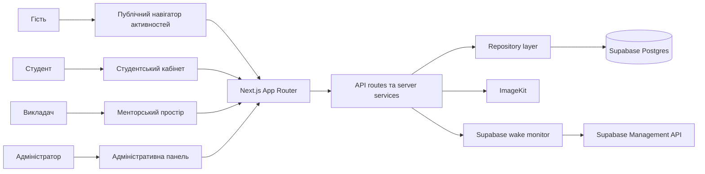
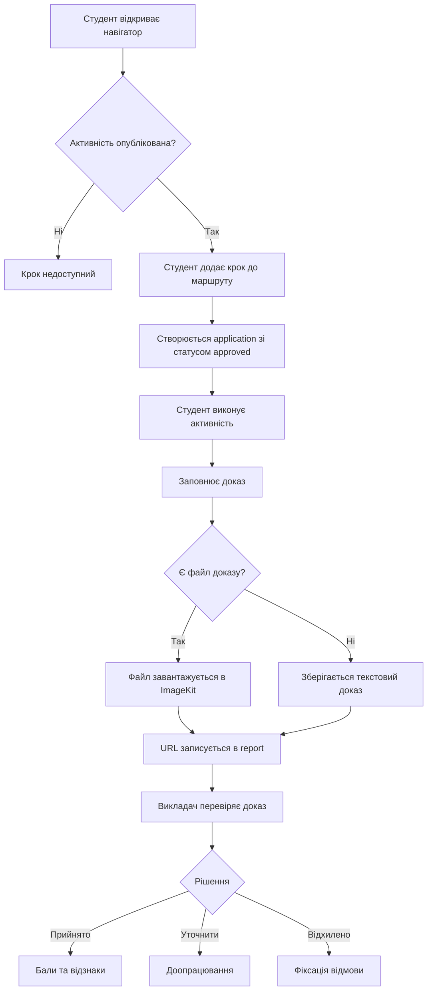
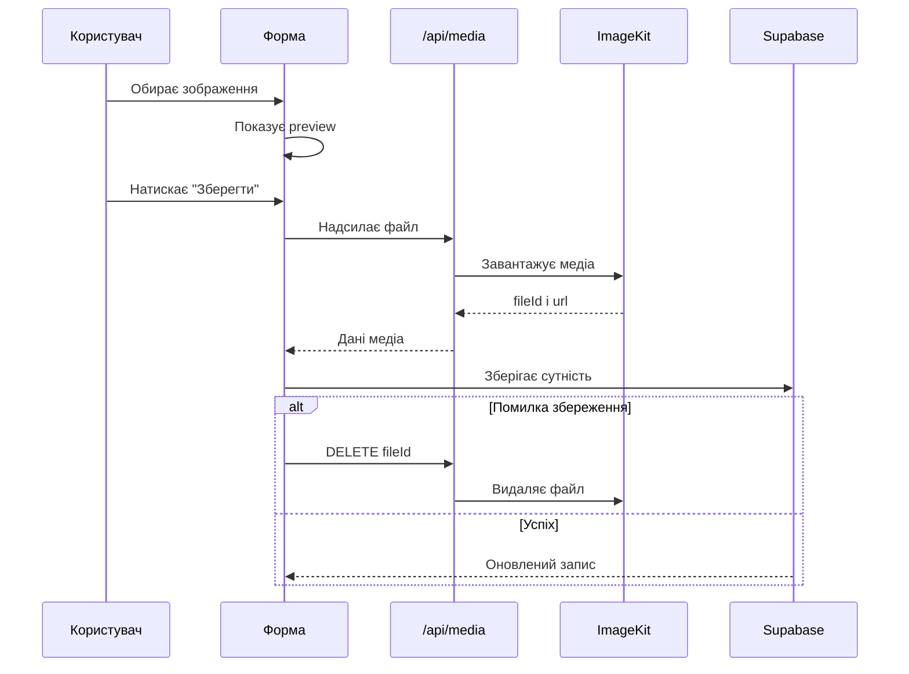
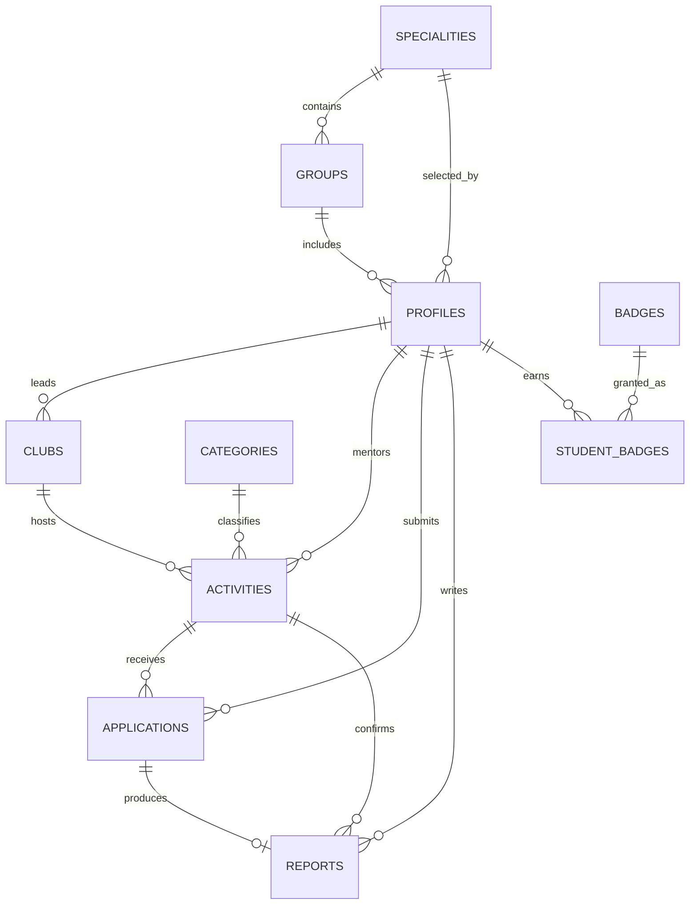
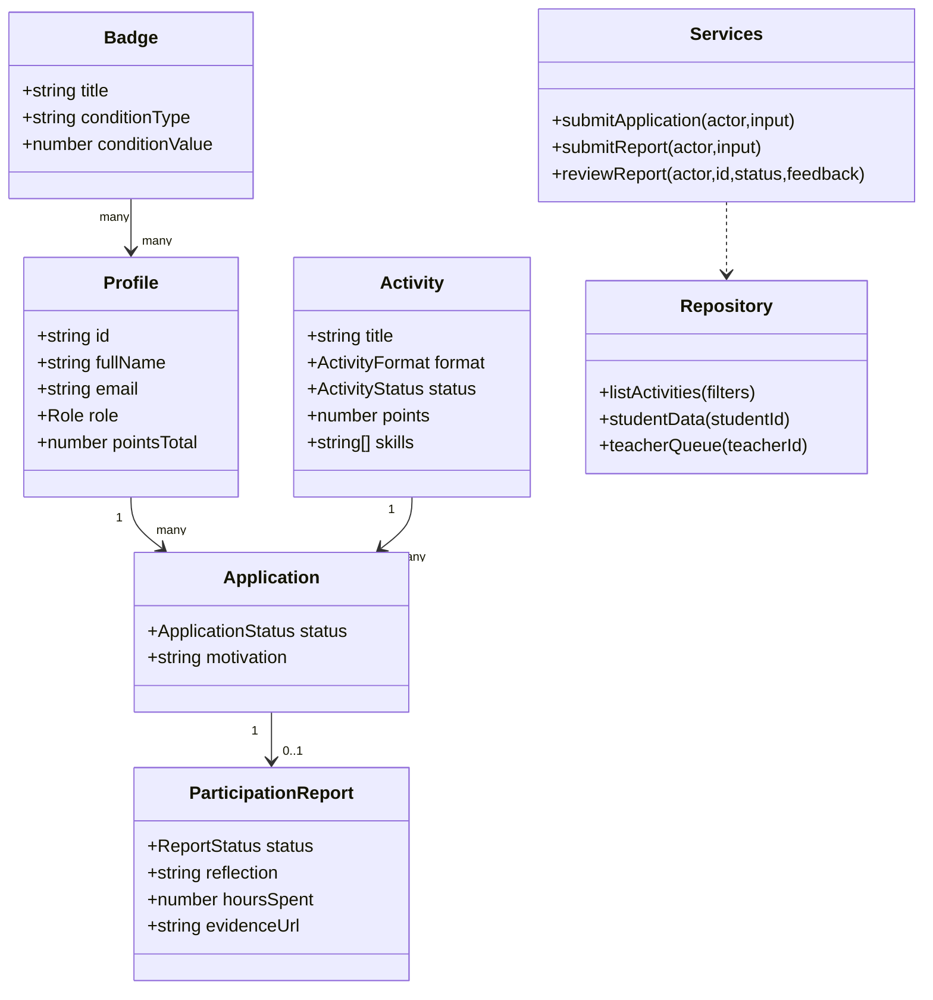

# ПОЯСНЮВАЛЬНА ЗАПИСКА ДО ДИПЛОМНОЇ РОБОТИ

Тема: **Розробка вебзастосунку “StudentFlow” для управління позааудиторною активністю студентів**
---
# РЕФЕРАТ

Пояснювальна записка присвячена розробці вебзастосунку **StudentFlow**, який забезпечує керування позааудиторною активністю студентів, формування індивідуального маршруту розвитку, подання доказів участі, перевірку результатів викладачем та адміністрування довідників, груп, спеціальностей, активностей і відзнак.

У роботі проаналізовано предметну область позааудиторної діяльності, розглянуто аналоги студентських engagement-платформ, обґрунтовано вибір архітектури на основі Next.js App Router, серверного шару з Supabase Postgres, ImageKit для медіафайлів та Render для production-розгортання. Окрему увагу приділено ролям користувачів, життєвому циклу активності, доказам результатів, автоматичному нарахуванню балів і відзнак.

Результатом роботи є адаптивний вебзастосунок із публічним навігатором активностей, студентським кабінетом, менторським простором викладача та адміністративною панеллю. Система підтримує початкове наповнення Supabase, синхронізацію медіа з ImageKit, запуск у production-режимі та механізм очікування доступності бази даних у разі паузи Supabase.

Ключові слова: **StudentFlow, позааудиторна активність, студентський маршрут, портфоліо, докази, відзнаки, Supabase, ImageKit, Next.js, Render**.
# ABSTRACT

This explanatory note describes the development of **StudentFlow**, a web application for managing students’ co-curricular activities. The system supports activity navigation, personal development routes, evidence submission, teacher feedback, badge assignment, group and speciality management, and administrative CRUD operations.

The thesis analyzes the subject area, compares relevant student engagement platforms, and justifies the selected architecture based on Next.js App Router, Supabase Postgres, ImageKit media storage, and Render deployment. The implementation focuses on role-based workflows for students, teachers, and administrators, as well as on evidence-based participation tracking.

The result is a responsive production-ready web application with a public activity navigator, student workspace, teacher review workspace, and administrative dashboard.
# ЗМІСТ

1. Характеристика об’єкту розроблення, постановка задачі, аналіз літературних джерел та системний аналіз  
1.1. Характеристика об’єкту розроблення та постановка задачі  
1.2. Огляд літератури та аналогічних систем  
1.3. Аналіз і вибір методів, алгоритмів та засобів розв’язання задачі  

2. Розроблення структури, алгоритмів та інформаційного забезпечення  
2.1. Структура або архітектура програми  
2.2. Блок-схеми алгоритмів  
2.3. Діаграми, які описують функціонування системи та її окремих блоків  
2.4. Структура даних та схема бази даних  

3. Розроблення програмного рішення  
3.1. Діаграма класів  
3.2. Опис використаних сторонніх бібліотек та модулів  
3.3. Розробка та опис програмних модулів  
3.4. Розробка та опис інтерфейсу користувача  
3.5. Опис альтернативних підходів, які розглядались під час розробки  
3.6. Опис проблем і нестандартних ситуацій, які виникали під час розробки та заходів для їх вирішення  

4. Експериментальна частина  
4.1. Інструкції адміністратору, програмісту та користувачу  
4.2. Вимоги до апаратно-програмного забезпечення  
4.3. Тестування  
4.4. Оцінювання та аналіз результатів  

Висновки  
Перелік використаних джерел  
Додатки  
# ВСТУП

Позааудиторна активність є важливою складовою розвитку студента, оскільки саме за межами обов’язкових занять часто формуються практичні навички комунікації, командної роботи, самопрезентації, дослідницької культури, лідерства та професійної орієнтації. У коледжі такі активності можуть охоплювати наукові мініпроєкти, дебати, медіамайстерні, кар’єрні зустрічі, спортивні події, студентське самоврядування, волонтерські чи культурні ініціативи. Проблема полягає не лише в організації таких подій, а й у фіксації результатів участі, збереженні доказів і перетворенні розрізнених подій на зрозумілий індивідуальний маршрут розвитку.

Традиційний підхід часто зводиться до оголошень у месенджерах, таблиць учасників, усних домовленостей та окремих файлів зі звітами. У такому форматі студенту складно бачити власний поступ, викладачу — перевіряти докази й давати структурований фідбек, а адміністратору — підтримувати цілісність довідників, груп, спеціальностей та активностей. Тому виникає потреба у вебзастосунку, який поєднує навігатор можливостей, маршрут студента, докази результатів і адміністративний контур.

Метою дипломної роботи є розробка вебзастосунку **StudentFlow** для управління позааудиторною активністю студентів, що забезпечує пошук активностей, формування маршруту участі, подання доказів, менторську перевірку, нарахування балів, видачу відзнак та адміністрування структури даних.

Для досягнення мети потрібно виконати такі завдання:

- проаналізувати предметну область позааудиторної активності студентів;
- розглянути наявні системи для студентського залучення та co-curricular record;
- визначити ролі користувачів і ключові сценарії роботи;
- спроєктувати структуру бази даних і зв’язки між сутностями;
- реалізувати публічний навігатор активностей;
- реалізувати студентський кабінет із маршрутами, доказами та відзнаками;
- реалізувати менторський простір викладача для перегляду активностей і перевірки доказів;
- реалізувати адміністративну панель з CRUD-операціями;
- забезпечити роботу з медіафайлами через ImageKit;
- підготувати production-запуск із Supabase та Render.

Об’єктом розроблення є процес організації та обліку позааудиторної активності студентів.

Предметом розроблення є вебзастосунок StudentFlow, його інформаційна модель, серверна логіка, користувацькі інтерфейси та алгоритми обробки маршрутів, доказів і відзнак.
# 1. ХАРАКТЕРИСТИКА ОБ’ЄКТУ РОЗРОБЛЕННЯ, ПОСТАНОВКА ЗАДАЧІ, АНАЛІЗ ЛІТЕРАТУРНИХ ДЖЕРЕЛ ТА СИСТЕМНИЙ АНАЛІЗ
## 1.1. Характеристика об’єкту розроблення та постановка задачі

Позааудиторна активність студента в межах StudentFlow розглядається як керований набір можливостей, де кожна активність має категорію, відповідальний клуб, викладача-ментора, дату проведення, формат, вимоги, очікуваний результат, кількість місць, бали та компетентності. На відміну від простого каталогу подій, система фіксує не лише факт реєстрації, а й подальший результат: подання доказу, перевірку, коментар викладача, нарахування балів і відкриття відзнак.

У предметній області виділено три основні ролі:

- **студент** — переглядає каталог, фільтрує активності, додає кроки до маршруту, подає докази, переглядає фідбек, бали й відзнаки;
- **викладач** — створює або супроводжує активності, переглядає заявки й докази студентів, приймає рішення щодо результатів, залишає фідбек;
- **адміністратор** — керує викладачами, студентами, активностями, довідниками, спеціальностями, групами, клубами, категоріями та відзнаками.

Функціональні вимоги до вебзастосунку:

- публічний перегляд активностей із пошуком, фільтрами та пагінацією;
- реєстрація тільки студентських профілів;
- вхід користувачів за email і паролем;
- розмежування доступу за ролями;
- створення, редагування та видалення довідників у адміністративній панелі;
- керування групами з роками навчання у назві;
- створення та редагування активностей з медіа;
- завантаження й попередній перегляд зображень у формах;
- подання студентом доказу участі;
- перегляд доказів адміністратором і викладачем;
- прийняття, відхилення або повернення доказу на доопрацювання;
- нарахування балів після прийняття доказу;
- автоматичне або ручне надання відзнак;
- пошук і пагінація у великих списках для всіх робочих зон;
- початкове наповнення Supabase тільки якщо база порожня;
- синхронізація медіа з ImageKit тільки для прив’язаних записів;
- production-запуск на Render.

Нефункціональні вимоги:

- адаптивність для мобільних, планшетних і десктопних екранів;
- відсутність службових текстів про розробку у користувацькому інтерфейсі;
- стабільна робота при paused Supabase на безкоштовному тарифі;
- збереження медіа без “сирітських” файлів у ImageKit;
- зрозуміла структура даних для подальшого перенесення або розширення;
- захист підвищених ролей від публічної реєстрації;
- production build без dev-індикаторів Next.js.

Постановка задачі полягає у створенні системи, яка не дублює волонтерський портал або просту дошку оголошень, а формує окрему логіку студентського розвитку. У StudentFlow центральною сутністю є не “волонтерська заявка”, а **крок маршруту**, пов’язаний з компетентностями, доказом і портфоліо.
## 1.2. Огляд літератури та аналогічних систем

Для формування вимог до StudentFlow було розглянуто кілька типів рішень: student engagement платформи, системи co-curricular transcript, інструменти керування волонтерською активністю, а також навчальні LMS, які частково перетинаються з предметною областю, але не розв’язують її повністю.

**Suitable** позиціонується як student engagement та student success платформа з акцентом на co-curricular transcript, experiential learning і мобільний досвід. Для StudentFlow корисною є ідея перетворення участі студента на цілісний запис досягнень, а не тільки на список подій. Водночас StudentFlow орієнтований на локальний контекст коледжу, прості ролі та власну структуру груп і спеціальностей.

**GivePulse** зосереджується на volunteer management, service-learning, реєстрації, комунікації та відстеженні волонтерських або громадських можливостей. Це рішення близьке до теми обліку участі, але StudentFlow не обмежується волонтерством. У системі передбачені дослідження, прототипування, баланс, медіа, лідерство, кар’єра та комунікація.

**Modern Campus Involve** розвиває ідею student engagement через організації, події, co-curricular learning і підтримку retention. Для StudentFlow важливою є не лише подія, а й її зв’язок з компетентностями, доказами та фідбеком викладача. Тому архітектура StudentFlow має менше зовнішніх інтеграцій, але більше уваги приділяє прозорому маршруту конкретного студента.

**Anthology Engage** орієнтується на студентські організації, involvement data, API та інтеграції. Його підхід показує, що позааудиторна активність може бути джерелом даних для менторства і студентського успіху. У StudentFlow цей принцип реалізовано через локальну модель: активності, заявки, звіти-докази, відзнаки та студентські профілі.

**Moodle** і **Google Classroom** розглядаються як навчальні системи, що добре працюють з курсами, матеріалами та завданнями, але менш точно описують позааудиторний маршрут. У них логіка зазвичай будується навколо дисципліни або класу, тоді як StudentFlow будується навколо добровільних активностей і портфоліо.

Порівняння аналогів:

| Система | Сильні сторони | Обмеження для задачі StudentFlow |
| --- | --- | --- |
| Suitable | Co-curricular transcript, досвід студента, компетентності | Орієнтація на готову комерційну платформу, менше контролю над локальною структурою |
| GivePulse | Волонтерські можливості, реєстрація, tracking, комунікація | Фокус на service-learning і волонтерстві, а не на всіх напрямах розвитку |
| Modern Campus Involve | Події, організації, student engagement, co-curricular learning | Надлишкова платформа для невеликого коледжного проєкту |
| Anthology Engage | Організації, involvement data, API-інтеграції | Потребує інституційного впровадження й зовнішньої екосистеми |
| Moodle / Google Classroom | Навчальні курси, завдання, викладацький контроль | Не є спеціалізованим маршрутом позааудиторної активності |

З аналізу аналогів сформовано такі вимоги до власної системи:

- активність повинна мати не лише опис, а й очікуваний результат;
- участь повинна завершуватися доказом, а не тільки реєстрацією;
- результат має бути пов’язаний із компетентностями;
- студент повинен бачити власний маршрут і портфоліо;
- викладач повинен мати швидкий контур перевірки;
- адміністратор повинен керувати довідниками без редагування коду;
- система має бути простою для локального запуску й production-розгортання.
## 1.3. Аналіз і вибір методів, алгоритмів та засобів розв’язання задачі

Для реалізації StudentFlow було обрано full-stack підхід на основі Next.js App Router. Такий підхід дозволяє поєднати сторінки, серверні маршрути, middleware, cookies, серверне читання Supabase та клієнтські інтерактивні форми в одному проєкті.

Основні технологічні рішення:

- **Next.js 15** — маршрутизація, серверні сторінки, API routes, production build;
- **React 19** — клієнтські компоненти форм, модальні вікна, toast-повідомлення;
- **TypeScript** — типізація доменних сутностей;
- **Supabase Postgres** — централізована база даних;
- **@supabase/supabase-js** — серверний доступ до таблиць через service role;
- **postgres** — виконання SQL-міграцій;
- **ImageKit** — зберігання зображень активностей, клубів, відзнак і доказів;
- **bcryptjs** — хешування паролів seed-акаунтів і нових користувачів;
- **Zod** — серверна валідація заявок, доказів і профілів;
- **Render** — production-розгортання Node.js web service.

Для предметної області обрано такі алгоритмічні рішення:

- маршрут студента формується через записи `applications`;
- доказ участі зберігається як `reports`;
- статуси заявок і доказів розділені;
- прийняття доказу переводить участь у стан `attended`;
- бали додаються тільки після прийняття доказу;
- відзнаки відкриваються за умовами `points`, `activities` або `category`;
- зображення завантажуються в ImageKit тільки після підтвердження форми;
- якщо збереження сутності не вдалося, тимчасово завантажене зображення видаляється.

Окремим рішенням є механізм роботи з paused Supabase. На безкоштовному тарифі база може бути тимчасово неактивною. Для цього реалізовано серверний модуль, який через Supabase Management API перевіряє статус проєкту, надсилає restore-запит і показує екран очікування лише тоді, коли база справді недоступна.
# 2. РОЗРОБЛЕННЯ СТРУКТУРИ, АЛГОРИТМІВ ТА ІНФОРМАЦІЙНОГО ЗАБЕЗПЕЧЕННЯ
## 2.1. Структура або архітектура програми

Архітектура StudentFlow побудована як монолітний full-stack вебзастосунок. Це не означає відсутність модульності: навпаки, в межах одного Next.js-проєкту розділено публічну зону, студентський кабінет, викладацький простір, адміністративну панель, API-маршрути, серверні сервіси, репозиторій доступу до даних, auth-модуль, ImageKit-модуль і Supabase wake-монітор.

Рисунок 2.1 показує компонентну архітектуру системи.



Файл діаграми: `output/doc/diagrams/figure_2_1_studentflow_component_architecture.mmd`.

У клієнтській частині виділено такі області:

- публічна головна сторінка;
- сторінка каталогу активностей;
- сторінка детального перегляду активності;
- форма входу;
- форма студентської реєстрації;
- студентський dashboard;
- сторінки заявок, доказів, відзнак і портфоліо;
- викладацькі сторінки активностей і перевірки доказів;
- адміністративні сторінки користувачів, активностей, довідників і відзнак.

Серверний шар складається з таких модулів:

- `src/server/repository.ts` — читання й агрегація даних;
- `src/server/services.ts` — доменні операції;
- `src/server/supabase-store.ts` — низькорівневий доступ до Supabase;
- `src/server/auth.ts` — поточний користувач, cookies, перевірка ролей;
- `src/server/imagekit.ts` — видалення медіа з ImageKit;
- `src/server/supabase-wake.ts` — пробудження Supabase;
- `src/server/api.ts` — уніфіковані API-відповіді.

Така структура обрана через практичність: для дипломного вебзастосунку не потрібні окремі frontend/backend репозиторії, але потрібне чітке розділення відповідальності.
## 2.2. Блок-схеми алгоритмів

Основний алгоритм StudentFlow — це перетворення активності на підтверджений елемент студентського портфоліо. Він не завершується на етапі “натиснути кнопку участі”. Після вибору активності студент повинен виконати дію, подати доказ, отримати фідбек і тільки тоді отримати бали.

Рисунок 2.2 показує алгоритм маршруту студента.



Файл діаграми: `output/doc/diagrams/figure_2_2_student_route_evidence_activity.mmd`.

Другий важливий алгоритм стосується зображень. У ранніх підходах файл міг завантажитися в хмарне сховище ще до підтвердження форми. У StudentFlow це виправлено: зображення потрапляє в ImageKit лише під час submit, а при помилці збереження видаляється.



Файл діаграми: `output/doc/diagrams/figure_2_2_media_upload_lifecycle.mmd`.

Алгоритми, які реалізовані в системі:

- фільтрація активностей за пошуком, категорією, клубом, форматом, складністю, доступністю місць;
- нормалізація slug при відкритті сторінки активності;
- створення заявки студентом;
- скасування кроку маршруту студентом;
- подання доказу з рефлексією, годинами, компетентностями й evidence URL;
- перевірка доказу викладачем або адміністратором;
- нарахування балів після прийняття доказу;
- відкриття відзнак за умовами;
- видалення пов’язаних записів через каскадні зв’язки бази;
- пробудження Supabase перед міграціями або під час runtime-запитів.
## 2.3. Діаграми, які описують функціонування системи та її окремих блоків

Функціонування StudentFlow описується через ролі, які мають різні права. На рівні інтерфейсу це виражено через окремі layout-зони: `/student`, `/teacher`, `/admin`. На рівні middleware та server-сервісів доступ контролюється через поточного користувача і його роль.

Варіанти використання студента:

- перегляд каталогу активностей;
- пошук і фільтрація можливостей;
- перегляд сторінки активності;
- створення студентського профілю;
- додавання активності до маршруту;
- скасування кроку маршруту;
- створення або оновлення доказу;
- перегляд статусу доказу;
- перегляд відзнак і портфоліо.

Варіанти використання викладача:

- перегляд власних активностей;
- перегляд студентських заявок і доказів;
- прийняття або відхилення доказу;
- повернення доказу на доопрацювання;
- перегляд маршруту конкретного студента;
- перегляд доказів із посиланнями на ImageKit.

Варіанти використання адміністратора:

- створення викладачів;
- керування студентами;
- керування активностями;
- керування групами, спеціальностями, клубами, категоріями;
- керування відзнаками;
- ручне надання або відкликання відзнак;
- редагування й видалення сутностей з підтвердженням;
- перегляд маршрутів і доказів студентів.

Таке розділення дозволяє не змішувати студентський досвід з адміністративним інструментарієм. Публічний користувач бачить лише навігатор, студент бачить власний маршрут, викладач працює з доказами, а адміністратор підтримує структуру системи.
## 2.4. Структура даних та схема бази даних

База даних StudentFlow побудована на Supabase Postgres. Схема створюється SQL-міграцією `supabase/migrations/0001_studentflow_schema.sql`. У ній визначено одинадцять основних таблиць.

Рисунок 2.4 відображає інформаційну модель.



Файл діаграми: `output/doc/diagrams/figure_2_4_studentflow_database_er.mmd`.

Призначення таблиць:

- `specialities` — перелік спеціальностей;
- `groups` — академічні групи з роками початку та завершення;
- `profiles` — користувачі з ролями student, teacher, admin;
- `mediaAssets` — метадані зображень, прив’язаних до ImageKit;
- `clubs` — організаційні осередки активностей;
- `categories` — напрями розвитку;
- `activities` — можливості для студентського маршруту;
- `applications` — кроки маршруту студента;
- `reports` — докази виконання активності;
- `badges` — відзнаки;
- `studentBadges` — видані студентам відзнаки.

Важливі зв’язки:

- група належить спеціальності;
- студент може належати групі та спеціальності;
- активність належить категорії, клубу та викладачу;
- заявка пов’язує студента з активністю;
- доказ пов’язаний із заявкою, студентом і активністю;
- відзнака може бути загальною або прив’язаною до категорії;
- студентські відзнаки зберігаються окремою таблицею.

Фрагмент SQL-структури бази даних:

```sql
create table if not exists "reports" (
  id text primary key,
  "applicationId" text not null references "applications"(id) on delete cascade,
  "activityId" text not null references "activities"(id) on delete cascade,
  "studentId" text not null references "profiles"(id) on delete cascade,
  status text not null check (status in ('draft','submitted','approved','rejected','needs_changes')),
  reflection text not null default '',
  "hoursSpent" integer not null default 0,
  "skillsGained" text not null default '',
  "evidenceUrl" text,
  "teacherFeedback" text,
  "reviewedBy" text references "profiles"(id) on delete set null,
  "createdAt" timestamptz not null,
  "updatedAt" timestamptz not null
);
```
# 3. РОЗРОБЛЕННЯ ПРОГРАМНОГО РІШЕННЯ
## 3.1. Діаграма класів

Доменна модель StudentFlow має просту, але цілісну структуру. Центральними класами є `Profile`, `Activity`, `Application`, `ParticipationReport`, `Badge` і `MediaAsset`. Допоміжні класи `Group`, `Speciality`, `Category` і `Club` задають контекст.



Файл діаграми: `output/doc/diagrams/figure_3_1_studentflow_class_diagram.mmd`.

У TypeScript ця модель відображена у файлі `src/types/entities.ts`.

```ts
export type Role = 'student' | 'teacher' | 'admin';
export type ApplicationStatus =
  | 'submitted'
  | 'under_review'
  | 'approved'
  | 'rejected'
  | 'cancelled'
  | 'attended'
  | 'missed';
export type ReportStatus =
  | 'draft'
  | 'submitted'
  | 'approved'
  | 'rejected'
  | 'needs_changes';

export interface Profile {
  id: string;
  fullName: string;
  email: string;
  passwordHash: string;
  role: Role;
  status: 'active' | 'inactive';
  groupId?: string;
  specialityId?: string;
  pointsTotal: number;
}
```
## 3.2. Опис використаних сторонніх бібліотек та модулів

У StudentFlow використано помірний набір бібліотек, щоб не перевантажувати застосунок зайвими залежностями.

Клієнтський і серверний стек:

- `next` — основа застосунку, маршрути, API, production build;
- `react` і `react-dom` — компоненти інтерфейсу;
- `typescript` — статична типізація;
- `@supabase/supabase-js` — робота із Supabase;
- `postgres` — виконання SQL-міграцій;
- `@imagekit/nodejs` — завантаження й видалення медіа;
- `bcryptjs` — хешування паролів;
- `zod` — серверна валідація;
- `lucide-react` — іконки інтерфейсу;
- `tsx` — запуск TypeScript-скриптів міграції та seed.

Вибір Next.js обґрунтований тим, що застосунок має одночасно публічні сторінки, захищені кабінети, серверні дії, cookies і API. Supabase обрано через готовий PostgreSQL, зручне підключення через service-role ключ і можливість розгортання без власного DB-сервера. ImageKit використано для хмарного зберігання зображень, оскільки докази й візуали активностей не повинні зберігатися тільки локально.
## 3.3. Розробка та опис програмних модулів
### 3.3.1 Модуль доступу до даних

Модуль `repository.ts` перетворює сирі записи бази на дані, готові до відображення. Наприклад, активність доповнюється категорією, клубом, викладачем, кількістю зайнятих місць і URL зображення.

```ts
export function activityView(database: DatabaseSnapshot, activity: Activity): ActivityView {
  const category = database.categories.find((item) => item.id === activity.categoryId)!;
  const club = database.clubs.find((item) => item.id === activity.clubId)!;
  const teacher = database.profiles.find((item) => item.id === activity.teacherId)!;
  const media = database.mediaAssets.find((item) => item.kind === 'activity' && item.imageKey === activity.imageKey);
  const approvedCount = database.applications
    .filter((item) => item.activityId === activity.id && ['approved', 'attended'].includes(item.status)).length;

  return {
    ...activity,
    category,
    club,
    teacher,
    approvedCount,
    availablePlaces: Math.max(0, activity.maxParticipants - approvedCount),
    imageUrl: media?.url,
    imageAlt: media?.alt,
  };
}
```

Пагінація винесена в окрему функцію, що дозволило використовувати однаковий принцип у каталозі, адмінці, студентських і викладацьких списках.

```ts
export function makePage<T>(items: T[], page = 1, pageSize = 6): Page<T> {
  const safePageSize = [6, 12, 24].includes(pageSize) ? pageSize : 6;
  const pageCount = Math.max(1, Math.ceil(items.length / safePageSize));
  const safePage = Math.min(Math.max(page, 1), pageCount);

  return {
    items: items.slice((safePage - 1) * safePageSize, safePage * safePageSize),
    total: items.length,
    page: safePage,
    pageSize: safePageSize,
    pageCount,
  };
}
```
### 3.3.2 Модуль студентського маршруту

Студент додає активність до маршруту через `submitApplication`. У поточній логіці заявка одразу отримує статус `approved`, оскільки система працює як маршрутний навігатор, а не як конкурсна черга.

```ts
export async function submitApplication(actor: Profile, input: unknown) {
  if (actor.role !== 'student') throw new DomainError('Маршрут формує студент.');
  const values = applicationSchema.parse(input);
  const database = await readDatabase();
  const activity = database.activities.find((item) => item.id === values.activityId);

  if (!activity || activity.status !== 'published') {
    throw new DomainError('Цей крок зараз недоступний.');
  }

  if (database.applications.some((item) =>
    item.studentId === actor.id &&
    item.activityId === activity.id &&
    !['cancelled', 'rejected', 'missed'].includes(item.status))) {
    throw new DomainError('Цей крок уже є у вашому маршруті.');
  }

  database.applications.push({
    id: randomUUID(),
    activityId: activity.id,
    studentId: actor.id,
    status: 'approved',
    motivation: values.motivation,
    createdAt: now(),
    updatedAt: now(),
  });

  await writeDatabase(database);
}
```
### 3.3.3 Модуль доказів і фідбеку

Доказ подається студентом після виконання активності. Він містить рефлексію, кількість годин, компетентності й необов’язкове посилання на файл.

```ts
export async function submitReport(actor: Profile, input: unknown) {
  if (actor.role !== 'student') throw new DomainError('Доказ додає студент.');
  const values = reportSchema.parse(input);
  const database = await readDatabase();
  const application = database.applications
    .find((item) => item.id === values.applicationId && item.studentId === actor.id);

  if (!application || !['approved', 'attended'].includes(application.status)) {
    throw new DomainError('Доказ можна додати лише до кроку у маршруті.');
  }

  const existing = database.reports.find((item) => item.applicationId === application.id);
  const report = existing ?? {
    id: randomUUID(),
    applicationId: application.id,
    activityId: application.activityId,
    studentId: actor.id,
    status: 'draft' as ReportStatus,
    reflection: '',
    hoursSpent: 0,
    skillsGained: '',
    createdAt: now(),
    updatedAt: now(),
  };

  report.reflection = values.reflection;
  report.hoursSpent = values.hoursSpent;
  report.skillsGained = values.skillsGained;
  report.status = 'submitted';
  report.updatedAt = now();
  if (values.evidenceUrl?.trim()) report.evidenceUrl = values.evidenceUrl.trim();

  if (!existing) database.reports.push(report);
  await writeDatabase(database);
}
```

Викладач або адміністратор перевіряє доказ. Якщо доказ прийнято, студент отримує бали, а система перевіряє умови відзнак.

```ts
export async function reviewReport(
  actor: Profile,
  reportId: string,
  status: Extract<ReportStatus, 'approved' | 'rejected' | 'needs_changes'>,
  feedback: string,
) {
  const database = await readDatabase();
  const report = database.reports.find((item) => item.id === reportId);
  if (!report) throw new DomainError('Доказ не знайдено.');

  const activity = database.activities.find((item) => item.id === report.activityId)!;
  if (actor.role !== 'admin' && !(actor.role === 'teacher' && activity.teacherId === actor.id)) {
    throw new DomainError('Немає доступу до цього доказу.');
  }

  const previousStatus = report.status;
  report.status = status;
  report.teacherFeedback = feedback.trim();
  report.reviewedBy = actor.id;
  report.updatedAt = now();

  const student = database.profiles.find((item) => item.id === report.studentId)!;
  if (status === 'approved' && previousStatus !== 'approved') {
    const application = database.applications.find((item) => item.id === report.applicationId)!;
    application.status = 'attended';
    student.pointsTotal += activity.points;
    unlockBadges(database, student);
  }

  await writeDatabase(database);
}
```
### 3.3.4 Модуль відзнак

Відзнаки відкриваються за трьома типами умов: загальна кількість балів, кількість завершених активностей або участь у певній категорії.

```ts
function unlockBadges(database: Awaited<ReturnType<typeof readDatabase>>, student: Profile) {
  const attended = database.applications
    .filter((item) => item.studentId === student.id && item.status === 'attended');

  for (const badge of database.badges.filter((item) => item.isActive)) {
    const condition =
      badge.conditionType === 'points'
        ? student.pointsTotal >= badge.conditionValue
        : badge.conditionType === 'activities'
          ? attended.length >= badge.conditionValue
          : attended.some((application) =>
              database.activities.find((activity) => activity.id === application.activityId)?.categoryId === badge.categoryId);

    if (condition && !database.studentBadges.some((item) =>
      item.studentId === student.id && item.badgeId === badge.id)) {
      database.studentBadges.push({
        id: randomUUID(),
        studentId: student.id,
        badgeId: badge.id,
        unlockedAt: now(),
      });
    }
  }
}
```
### 3.3.5 Модуль медіа та ImageKit

Зображення у формах мають попередній перегляд. Файл не завантажується одразу після вибору, а очікує підтвердження форми. Це зменшує кількість зайвих файлів у хмарному сховищі.

```ts
async function requestWithImages(
  form: HTMLFormElement,
  submit: (values: Record<string, string>) => Promise<ApiResult>,
) {
  const uploads = await uploadPendingImages(form);
  try {
    const result = await submit(formValues(form));
    if (!result.success) await cleanupUploadedImages(uploads);
    return result;
  } catch (error) {
    await cleanupUploadedImages(uploads);
    throw error;
  }
}
```

На сервері ImageKit використовується для видалення файлів, якщо запис більше не посилається на медіа.

```ts
export async function deleteImageKitFile(fileId?: string) {
  const client = imagekitClient();
  if (!client || !fileId) return;
  await client.files.delete(fileId).catch(() => undefined);
}
```
### 3.3.6 Модуль запуску Supabase

Для локального запуску й Render-деплою реалізовано setup-скрипт, який не перезаписує непорожню базу.

```ts
const beforeSeed = await readDatabase();

if (rowCount(beforeSeed) === 0) {
  console.log('Supabase is empty. Running initial seed.');
  runNpmScript('db:seed');
} else {
  console.log(`Supabase already contains data (${rowCount(beforeSeed)} rows). Initial seed skipped.`);
}
```

Міграція перед підключенням до БД може пробуджувати Supabase, якщо проєкт перебуває в paused/inactive стані.

```ts
let status = await getSupabaseWakeStatus({ restoreIfPaused: true });

while (status.state !== 'ready') {
  console.log(`${status.message} Статус: ${status.projectStatus ?? status.state}. Повторна перевірка за 10 секунд.`);
  await sleep(10_000);
  status = await getSupabaseWakeStatus({ restoreIfPaused: true });
}
```
## 3.4. Розробка та опис інтерфейсу користувача

Інтерфейс StudentFlow побудований як робочий простір, а не як демонстраційна сторінка. У ньому відсутні тексти про те, що “сайт створено для демонстрації технологій”. Усі написи мають операційне призначення: знайти активність, подати доказ, переглянути маршрут, відкрити відзнаки, перевірити звіт або відредагувати довідник.

Публічна зона містить:

- головну сторінку з коротким позиціонуванням StudentFlow;
- навігатор активностей;
- картки активностей із категорією, балами, датою та місцями;
- фільтри за напрямом, клубом, форматом, складністю та доступністю;
- пошук і пагінацію.

Студентський кабінет містить:

- dashboard із поточним станом маршруту;
- список активностей у маршруті;
- форму подання доказу;
- сторінку відзнак;
- портфоліо для друку або перегляду.

Викладацький простір містить:

- перелік активностей викладача;
- список доказів на перевірку;
- перегляд маршруту студента;
- рішення щодо доказу з коментарем.

Адміністративна панель містить:

- управління студентами;
- управління викладачами;
- управління активностями;
- довідники груп, спеціальностей, клубів і категорій;
- управління відзнаками;
- перегляд доказів;
- CRUD-дії з підтвердженням видалення.

Для всіх списків, де кількість записів може зростати, додано пошук, вибір кількості записів на сторінці та пагінацію. Це важливо для адміністрування, бо seed уже містить десятки активностей, студентів, заявок і доказів.
## 3.5. Опис альтернативних підходів, які розглядались під час розробки

Під час розробки розглядалися такі альтернативи:

1. **Локальне JSON-сховище замість Supabase.**  
   Цей варіант зручний для першого прототипу, але не підходить для production-розгортання, спільної роботи й централізованого доступу. Тому локальне зберігання було прибрано після переходу на Supabase.

2. **Окремий backend на Express або NestJS.**  
   Такий підхід дає більше архітектурної формальності, але для StudentFlow створює зайве розділення. Next.js API routes достатньо для обробки форм, авторизації, медіа й адміністративних операцій.

3. **Supabase Storage замість ImageKit.**  
   Supabase Storage логічно інтегрується з базою, але ImageKit зручніший для оптимізації, thumbnail URL і delivery зображень. Оскільки в системі важливі візуали активностей і докази, ImageKit був обраний як окремий медіашар.

4. **Публічна реєстрація викладачів.**  
   Такий підхід створює ризик підвищення ролі без контролю. У StudentFlow викладачів створює адміністратор, а публічна реєстрація доступна тільки студентам.

5. **Окремий модуль службової статистики.**  
   Від нього відмовлено, оскільки поточна задача — керування активностями, доказами, відзнаками й довідниками, а не система моніторингу службових подій.
## 3.6. Опис проблем і нестандартних ситуацій, які виникали під час розробки та заходів для їх вирішення

Під час розробки виникли такі ситуації:

- **небажана схожість з Volunteer Hub** — структуру було перероблено навколо маршрутів, доказів, груп, компетентностей і відзнак;
- **змішування кольору тексту з фоном** — виправлено контраст у темних і світлих блоках;
- **службові тексти в UI** — видалено повідомлення про розробку, серверні фільтри та ролі;
- **відсутність CRUD у адмінці** — додано редагування, видалення з підтвердженням і очищення пов’язаних медіа;
- **зайві ImageKit-файли після скасованої форми** — реалізовано відкладене завантаження й cleanup при помилці;
- **paused Supabase** — додано wake-логіку через Management API;
- **помилковий DB-waiter під час звичайної навігації** — звичайний route loading відокремлено від реального стану запуску БД;
- **відсутність пошуку й пагінації в робочих списках** — додано спільні list controls.
# 4. ЕКСПЕРИМЕНТАЛЬНА ЧАСТИНА
## 4.1. Інструкції адміністратору, програмісту та користувачу
### Інструкція адміністратору

Адміністратор входить у систему через створений seed-акаунт. Після входу він має доступ до адміністративної панелі, де може:

- переглядати студентів;
- активувати або деактивувати користувачів;
- створювати викладачів;
- створювати, редагувати й видаляти активності;
- керувати довідниками;
- керувати відзнаками;
- вручну видавати або відкликати відзнаки;
- переглядати маршрути студентів;
- відкривати докази участі.

Під час видалення сутностей система використовує підтвердження. Для пов’язаних сутностей діють каскадні правила бази даних або доменна логіка очищення медіа.
### Інструкція програмісту

Для локального запуску потрібно:

1. Встановити Node.js 22 або новіший.
2. Скопіювати `.env.example` у `.env`.
3. Заповнити Supabase та ImageKit ключі.
4. Запустити `start-local.bat` або виконати команди:

```powershell
npm install
npm run setup
npm run dev
```

Для production-розгортання на Render:

```text
Build Command: npm ci && npm run render:build
Start Command: npm run start
```

Скрипт `render:build` спочатку виконує міграції й seed-if-empty, а потім збирає production build.
### Інструкція користувачу

Студент виконує такі дії:

- реєструється через публічну форму;
- обирає групу та спеціальність;
- переглядає навігатор активностей;
- додає активність до маршруту;
- після участі подає доказ;
- очікує фідбек викладача;
- переглядає бали й відзнаки;
- формує портфоліо.

Викладач виконує такі дії:

- входить через створений адміністратором обліковий запис;
- переглядає власні активності;
- відкриває докази студентів;
- приймає доказ, відхиляє його або повертає на уточнення;
- переглядає маршрут студента.
## 4.2. Вимоги до апаратно-програмного забезпечення

Мінімальні вимоги для користувача:

- сучасний браузер Chrome, Edge, Firefox або Safari;
- стабільне підключення до інтернету;
- екран від 360 px завширшки;
- можливість завантаження зображень для доказів.

Вимоги для розробника:

- Windows 10/11 або інша ОС з Node.js;
- Node.js 22+;
- npm;
- доступ до Supabase;
- доступ до ImageKit;
- Git.

Вимоги для production:

- Render Web Service;
- Supabase проєкт;
- Supabase service role key;
- Supabase database connection string;
- Supabase Management API token для wake-механізму;
- ImageKit public/private keys.
## 4.3. Тестування

У межах перевірки працездатності доцільно виконувати такі сценарії:

- відкрити головну сторінку;
- перейти до навігатора активностей;
- перевірити пошук і фільтри;
- зареєструвати студента;
- увійти студентом;
- додати активність до маршруту;
- подати доказ з текстом і зображенням;
- увійти викладачем;
- прийняти доказ;
- перевірити нарахування балів;
- перевірити появу відзнаки;
- увійти адміністратором;
- створити, відредагувати й видалити довідник;
- створити активність із зображенням;
- перевірити адаптивність модального вікна на малому екрані;
- перевірити production build.

Для технічної перевірки використовуються команди:

```powershell
npm run typecheck
npm run build
npm run render:build
```

Команда `typecheck` перевіряє TypeScript без генерації файлів. Команда `build` створює production-збірку Next.js. Команда `render:build` додатково перевіряє setup-процес, який буде виконуватися на Render.
## 4.4. Оцінювання та аналіз результатів

Розроблений вебзастосунок задовольняє поставлені вимоги:

- реалізовано публічний каталог активностей;
- створено студентський маршрут;
- реалізовано подання доказів;
- реалізовано перевірку доказів викладачем;
- додано бали й відзнаки;
- реалізовано адміністративний CRUD;
- додано групи, спеціальності, клуби й категорії;
- реалізовано ImageKit для медіа;
- реалізовано Supabase як production-базу;
- підготовлено Render-конфігурацію;
- забезпечено адаптивні модальні вікна;
- додано пошук і пагінацію для великих списків.

Головна практична цінність StudentFlow полягає в тому, що позааудиторна активність перестає бути набором розрізнених подій. Вона перетворюється на керований маршрут з доказами, фідбеком і портфоліо. Це корисно для студента, який бачить власний розвиток; для викладача, який може перевіряти результати; і для адміністратора, який підтримує структуру системи без ручних таблиць.
# ВИСНОВКИ

У дипломній роботі розроблено вебзастосунок StudentFlow для управління позааудиторною активністю студентів. Під час виконання роботи проаналізовано предметну область, розглянуто аналоги, визначено ролі користувачів, спроєктовано інформаційну модель, реалізовано серверну логіку, користувацькі інтерфейси, медіазавантаження, механізм відзнак і production-запуск.

Система відрізняється від простих каталогів подій тим, що працює з повним циклом участі: вибір активності, маршрут, доказ, фідбек, бали, відзнаки та портфоліо. У роботі реалізовано не тільки студентський інтерфейс, а й викладацький та адміністративний контури, що робить застосунок придатним для реального використання в освітньому середовищі.

Подальший розвиток може включати експорт портфоліо у PDF, інтеграцію з електронним журналом, підпис доказів викладачем, додаткові критерії відзнак і календар активностей.
# ПЕРЕЛІК ВИКОРИСТАНИХ ДЖЕРЕЛ

1. Next.js Documentation. App Router. URL: https://nextjs.org/docs/app
2. Next.js Documentation. Deploying. URL: https://nextjs.org/docs/pages/getting-started/deploying
3. Supabase Docs. JavaScript Client Library. URL: https://supabase.com/docs/reference/javascript/introduction
4. Supabase Docs. Overview. URL: https://supabase.com/docs
5. ImageKit Documentation. URL: https://imagekit.io/docs
6. ImageKit Node.js SDK. URL: https://github.com/imagekit-developer/imagekit-nodejs
7. Render Docs. Deploy a Next.js App. URL: https://render.com/docs/deploy-nextjs-app
8. Suitable. Student Engagement Software & Student Success Software. URL: https://www.suitable.co/
9. Suitable. Co-Curricular Transcripts. URL: https://www.suitable.co/products/co-curricular-transcripts
10. GivePulse. Volunteer Management and Service-Learning Platform. URL: https://learn.givepulse.com/
11. Modern Campus Involve. Student Engagement and Learning Platform. URL: https://moderncampus.com/products/student-engagement-and-learning-platform
12. Anthology Engage / Encoura. Student Engagement Platform. URL: https://encoura.org/anthology/enrollment-and-retention/engage
13. Microsoft Marketplace. Anthology Engage. URL: https://marketplace.microsoft.com/en-us/product/saas/anthology.anthologyengage
14. TypeScript Documentation. URL: https://www.typescriptlang.org/docs/
15. React Documentation. URL: https://react.dev/
# ДОДАТКИ
## Додаток А. Перелік графічних матеріалів

- `output/doc/diagrams/figure_2_1_studentflow_component_architecture.mmd` — компонентна архітектура StudentFlow;
- `output/doc/diagrams/figure_2_2_student_route_evidence_activity.mmd` — алгоритм маршруту й доказу;
- `output/doc/diagrams/figure_2_2_media_upload_lifecycle.mmd` — життєвий цикл медіа;
- `output/doc/diagrams/figure_2_4_studentflow_database_er.mmd` — ER-модель бази даних;
- `output/doc/diagrams/figure_3_1_studentflow_class_diagram.mmd` — діаграма класів.
## Додаток Б. Основні файли програмної реалізації

- `src/types/entities.ts` — доменні типи;
- `supabase/migrations/0001_studentflow_schema.sql` — схема бази даних;
- `src/server/repository.ts` — читання й агрегація даних;
- `src/server/services.ts` — доменна логіка;
- `src/server/supabase-store.ts` — доступ до Supabase;
- `src/server/supabase-wake.ts` — автоматичний запуск paused Supabase;
- `src/components/features/forms.tsx` — форми, модальні вікна та ImageKit upload flow;
- `src/app/api/*` — API-маршрути;
- `scripts/seed-data.ts` — початкове наповнення;
- `scripts/setup-supabase.ts` — seed-if-empty та ImageKit sync;
- `render.yaml` — конфігурація Render.
